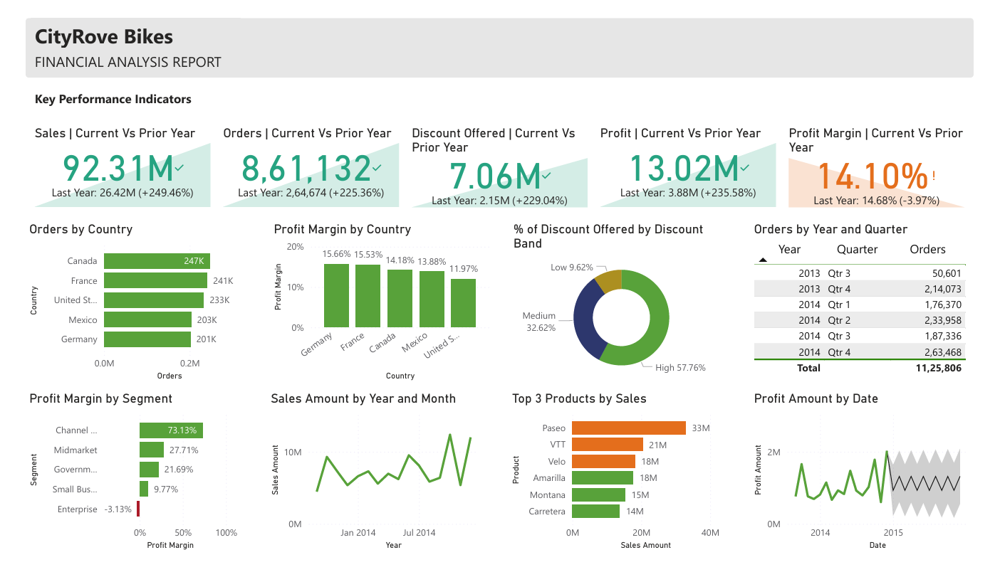

# Financial Analysis Report – CityRove Bikes

This Power BI dashboard presents a comprehensive financial analysis for **CityRove Bikes**, based on the built-in sample dataset available in Power BI Desktop. It explores key business metrics such as sales, profit, orders, discounts, and profit margins - with a focus on actionable insights across regions, customer segments, and time periods.

---

## Dashboard Preview

---

## Tools & Skills Demonstrated

- Power BI Desktop
- DAX Measures
- Custom formatting and conditional visuals
- Forecasting using Analytics pane
- Report layout and UX best practices
- Exporting and sharing reports via PDF and image
